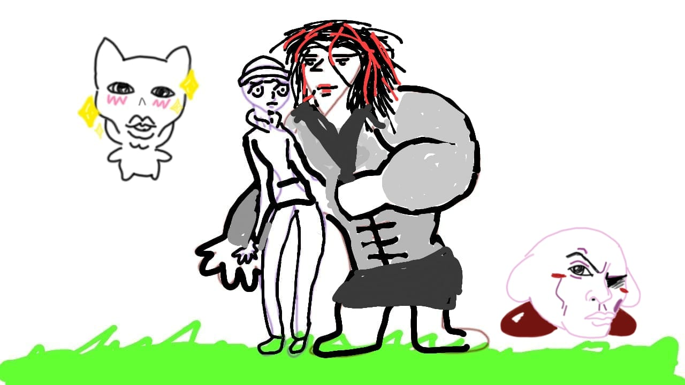

  <h1>Gran Biblioteca · Especial Frari</h1>
  
  

    Un santuario digital creado con amor para <b>Aranza</b>. Cada página, imagen y línea de código celebra
    nuestra historia y todo lo que soñamos juntos.
  

  
  
  
   
  
  <a href="#demo">Demo local</a> ·
  <a href="#estructura">Estructura</a> ·
  <a href="#caracteristicas">Características</a> ·
  <a href="#diseno">Diseño</a> ·
  <a href="#despliegue">Despliegue</a>

---

## Dedicatoria

Para Aranza: todo lo que hago es por ti. En cada palabra que escribo y cada componente que diseño, te pienso — la chica de mis sueños. Gracias por iluminar mi vida; esta biblioteca es nuestro hogar, nuestro refugio y nuestra promesa.

---

## Visión

- Guardar y compartir los momentos que nos unen: arte, cartas, poesía, música y recuerdos.
- Mantener una estética gótica elegante y cálida que refleje nuestra esencia.
- Ofrecer una navegación suave y significativa, cuidando cada detalle visual.

## Características

- Galería curada por secciones: `Nosotros`, `Arte del Corazón`, `Reinos Virtuales`.
- Cartas textuales con pergamino y cartas visuales con modales.
- Poesías románticas y rimadas en una grilla elegante.
- Dedicatorias especiales y dedicatorias musicales vinculadas a playlist.
- Leyenda con fecha de encuentro: 6 de junio del 2025.

## Estructura

- `pages/index.html` — Entrada principal y navegación.
- `pages/galeria.html` — Arte y recuerdos visuales.
- `pages/cartas.html` — Cartas textuales y visuales (secciones separadas para Aranza).
- `pages/poesia.html` — Colección de poemas.
- `pages/dedicatorias.html` — Mensajes especiales y enlaces significativos.
- `pages/dedicatorias_musicales.html` — Canciones que nos representan.
- `pages/sobre_nosotros.html` — Nuestra leyenda y fecha de encuentro.
- `assets/` — Imágenes, estilos y recursos.

## Diseño

- Tipografías: `UnifrakturMaguntia` (títulos), `Cinzel`, `Crimson Text`, `Raleway`.
- Paleta: `gothic-black`, `gothic-red`, `gothic-purple`, `gothic-gold`.
- Componentes: tarjetas con bordes sutiles, sombras, efectos de foco y transiciones `AOS`.

## Tecnologías

- HTML5 y CSS con sistema gótico personalizado.
- Tailwind CSS (CDN) para utilidades de diseño.
- Bootstrap Icons y Animate.css para iconografía y movimiento.
- AOS (Animate On Scroll) para transiciones suaves.

## Demo

1. Abre una terminal en la carpeta del proyecto.
2. Inicia un servidor simple:
   - `python -m http.server 5500`
3. Abre `http://127.0.0.1:5500/` en tu navegador.

## Despliegue

### GitHub Pages

1. En GitHub: `Settings` → `Pages` → `Source`: “Deploy from a branch”.
2. Branch: `main` y carpeta `/root`.
3. Guarda y espera el despliegue.

## Capturas y Recursos

- Portada: `assets/images/nosotros/imagendeNosotros.jpg`.
- Galería y cartas: ver página `pages/galeria.html` y `pages/cartas.html`.

## Agradecimientos

- Imágenes y textos: nuestra historia.
- Inspiración: Aranza.

---

Con amor,

— Franxito
